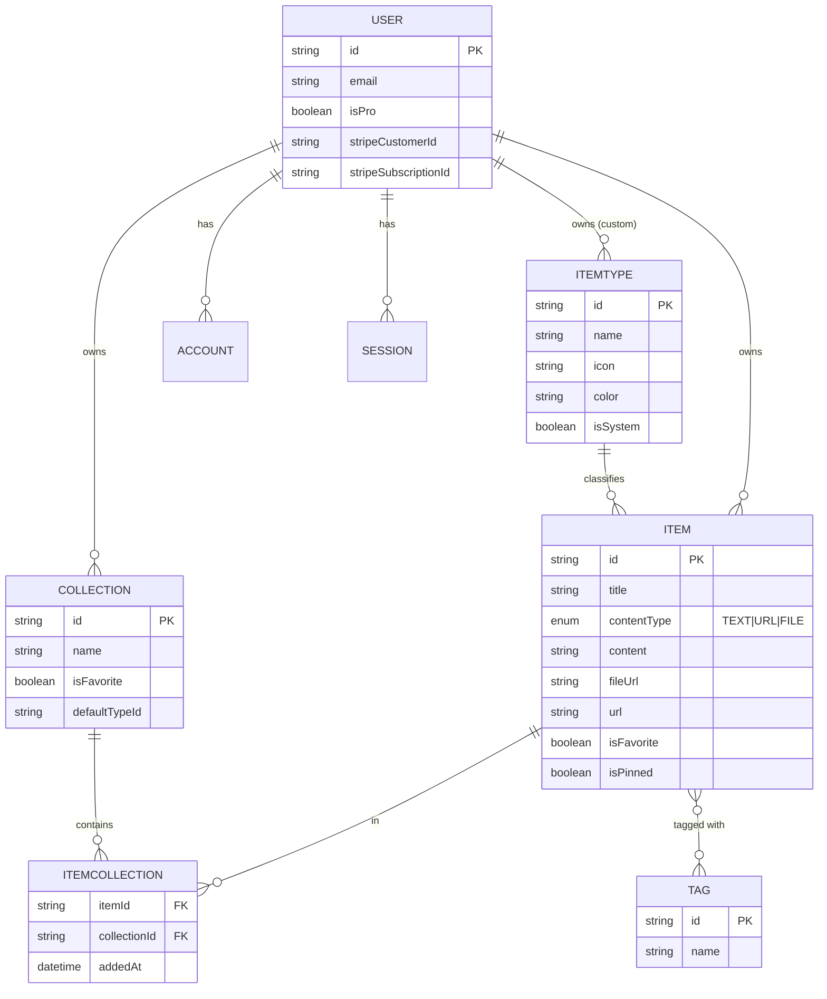
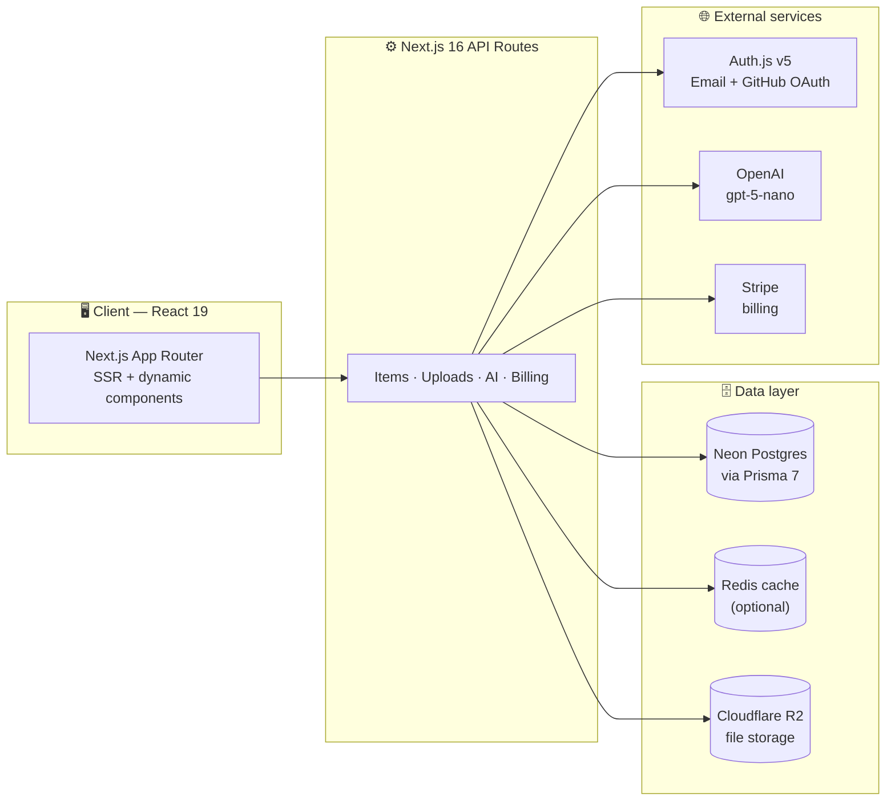

# 📦 DevStash AI — Project Overview

> **One fast, searchable, AI-enhanced hub for all of a developer's knowledge and resources.**
> Snippets, prompts, commands, notes, links, and files — captured in one place instead of scattered across VS Code, Notion, chats, bookmarks, gists, and `.txt` files.

**Status:** Planning / Foundation
**Last updated:** 2026-07-05

---

## 1. The Problem

Developers keep their essentials scattered across too many tools:

| Where it lives today | What it is |
| --- | --- |
| VS Code / Notion | Code snippets |
| AI chats | Prompts, system messages |
| Buried project folders | Context files |
| Browser bookmarks | Useful links |
| Random folders | Docs |
| `.txt` files | Commands |
| GitHub gists | Project templates / boilerplates |
| Bash history | Terminal commands |

The result is constant **context switching**, **lost knowledge**, and **inconsistent workflows**.

**DevStash AI** solves this by providing a single, fast, searchable, AI-enhanced hub for all dev knowledge and resources.

---

## 2. Target Users

| Persona | Primary need |
| --- | --- |
| 🧑‍💻 **Everyday Developer** | Fast way to grab snippets, prompts, commands, and links |
| 🤖 **AI-first Developer** | Save prompts, contexts, workflows, and system messages |
| 🎓 **Content Creator / Educator** | Store code blocks, explanations, and course notes |
| 🏗️ **Full-stack Builder** | Collect patterns, boilerplates, and API examples |

---

## 3. Core Concepts

### Items

An **Item** is the atomic unit of DevStash. Every item has a **type**, which determines its content shape and how it renders.

Item types resolve to one of three underlying **content shapes**:

- **text** — snippet, prompt, note, command
- **url** — link
- **file** — file, image *(Pro only)*

Users can eventually create **custom types** (Pro, later), but the app ships with seven **system types** that cannot be edited or deleted:

| Type | Shape | Color | Icon (lucide-react) | URL |
| --- | --- | --- | --- | --- |
| 🟦 Snippet | text | `#3b82f6` (blue) | `Code` | `/items/snippets` |
| 🟪 Prompt | text | `#8b5cf6` (purple) | `Sparkles` | `/items/prompts` |
| 🟧 Command | text | `#f97316` (orange) | `Terminal` | `/items/commands` |
| 🟨 Note | text | `#fde047` (yellow) | `StickyNote` | `/items/notes` |
| ⬜ File *(Pro)* | file | `#6b7280` (gray) | `File` | `/items/files` |
| 🟥 Image *(Pro)* | file | `#ec4899` (pink) | `Image` | `/items/images` |
| 🟩 Link | url | `#10b981` (emerald) | `Link` | `/items/links` |

Items are **quick to create and open** inside a **drawer** rather than a full page navigation.

### Collections

A **Collection** groups items of *any* type. An item can belong to **multiple collections** — e.g. a React snippet living in both *React Patterns* and *Interview Prep* — handled through a join table.

Examples: *React Patterns* (snippets, notes), *Context Files* (files), *Python Snippets* (snippets).

### Tags

Lightweight labels applied to items to power search and organization.

---

## 4. Features

### Items & organization

- Seven system item types + future custom types (Pro)
- Quick create / quick open via **drawer**
- Favorite items and collections
- Pin items to top
- Recently used
- View which collections an item belongs to
- Add/remove items to/from multiple collections
- Import code from a file
- Markdown editor for text types with syntax highlighting
- File upload for `file` / `image` types (Pro)
- Export data in multiple formats (JSON / ZIP)
- Dark mode by default

### Search

Powerful search across **content**, **tags**, **titles**, and **types**.

### Authentication

Email/password or **GitHub** sign-in (via Auth.js v5).

### 🤖 AI Features *(Pro only)*

| Feature | What it does |
| --- | --- |
| AI auto-tag suggestions | Suggests tags from item content |
| AI summaries | Condenses long notes/snippets |
| Explain this code | Plain-language explanation of a snippet |
| Prompt optimizer | Rewrites/optimizes saved prompts |

---

## 5. Data Model

> ⚠️ Draft schema — not set in stone. Uses **Prisma 7** (Rust-free TypeScript client). `contentType`, `itemType`, and plan are modeled explicitly; the collection ↔ item relation runs through the `ItemCollection` join table.

### Entity-relationship diagram



### Prisma schema (draft)

```prisma
// schema.prisma
generator client {
  provider = "prisma-client"      // Prisma 7 TypeScript client
  output   = "../src/generated/prisma" // required by the new generator
}

datasource db {
  provider = "postgresql"
  url      = env("DATABASE_URL") // Neon Postgres
}

enum ContentType {
  TEXT
  URL
  FILE
}

// -------- Auth / billing --------

model User {
  id                   String   @id @default(cuid())
  name                 String?
  email                String?  @unique
  emailVerified        DateTime?
  image                String?

  // Billing / plan
  isPro                Boolean  @default(false)
  stripeCustomerId     String?  @unique
  stripeSubscriptionId String?  @unique

  // Relations
  accounts    Account[]
  sessions    Session[]
  items       Item[]
  collections Collection[]
  itemTypes   ItemType[]   // custom types (system types have null user)

  createdAt DateTime @default(now())
  updatedAt DateTime @updatedAt
}

// NextAuth / Auth.js v5 adapter models
model Account {
  id                String  @id @default(cuid())
  userId            String
  type              String
  provider          String
  providerAccountId String
  refresh_token     String?
  access_token      String?
  expires_at        Int?
  token_type        String?
  scope             String?
  id_token          String?
  session_state     String?
  user User @relation(fields: [userId], references: [id], onDelete: Cascade)

  @@unique([provider, providerAccountId])
}

model Session {
  id           String   @id @default(cuid())
  sessionToken String   @unique
  userId       String
  expires      DateTime
  user User @relation(fields: [userId], references: [id], onDelete: Cascade)
}

model VerificationToken {
  identifier String
  token      String   @unique
  expires    DateTime

  @@unique([identifier, token])
}

// -------- Domain --------

model ItemType {
  id       String  @id @default(cuid())
  name     String
  icon     String  // lucide-react icon name, e.g. "Code"
  color    String  // hex, e.g. "#3b82f6"
  isSystem Boolean @default(false)

  userId String? // null for system types
  user   User?   @relation(fields: [userId], references: [id], onDelete: Cascade)

  items Item[]

  @@index([userId])
}

model Item {
  id          String      @id @default(cuid())
  title       String
  description String?
  contentType ContentType @default(TEXT)

  // Text content (null when file)
  content  String?
  language String? // optional, for code highlighting

  // File content (R2), null when text
  fileUrl  String?
  fileName String?
  fileSize Int?    // bytes

  // Link content
  url String?

  isFavorite Boolean @default(false)
  isPinned   Boolean @default(false)

  userId     String
  user       User     @relation(fields: [userId], references: [id], onDelete: Cascade)
  itemTypeId String
  itemType   ItemType @relation(fields: [itemTypeId], references: [id])

  collections ItemCollection[]
  tags        Tag[]

  createdAt DateTime @default(now())
  updatedAt DateTime @updatedAt

  @@index([userId])
  @@index([itemTypeId])
}

model Collection {
  id            String  @id @default(cuid())
  name          String
  description   String?
  isFavorite    Boolean @default(false)
  defaultTypeId String? // default item type for empty collections

  userId String
  user   User   @relation(fields: [userId], references: [id], onDelete: Cascade)

  items ItemCollection[]

  createdAt DateTime @default(now())
  updatedAt DateTime @updatedAt

  @@index([userId])
}

model ItemCollection {
  itemId       String
  collectionId String
  addedAt      DateTime @default(now())

  item       Item       @relation(fields: [itemId], references: [id], onDelete: Cascade)
  collection Collection @relation(fields: [collectionId], references: [id], onDelete: Cascade)

  @@id([itemId, collectionId])
  @@index([collectionId])
}

model Tag {
  id    String @id @default(cuid())
  name  String @unique
  items Item[]
}
```

> **🚫 Migration rule:** Never use `prisma db push` or edit the database structure directly. All schema changes go through **migrations**, run in **dev first, then prod**.

---

## 6. Architecture



Single codebase / single repo to reduce overhead, fully typed with **TypeScript**.

---

## 7. Tech Stack

| Layer | Choice | Notes |
| --- | --- | --- |
| Framework | [Next.js 16](https://nextjs.org/blog/next-16) / [React 19](https://react.dev) | App Router, SSR pages, dynamic components, API routes; Turbopack default |
| Language | [TypeScript](https://www.typescriptlang.org/) | End-to-end type safety |
| Database | [Neon](https://neon.tech/) Postgres | Serverless cloud Postgres |
| ORM | [Prisma 7](https://www.prisma.io/blog/announcing-prisma-orm-7-0-0) | Rust-free TS client; migrations only |
| Cache | [Redis](https://redis.io/) *(maybe)* | Caching layer |
| File storage | [Cloudflare R2](https://developers.cloudflare.com/r2/) | Uploads (Pro) |
| Auth | [Auth.js v5](https://authjs.dev/) (NextAuth) | Email/password + GitHub OAuth |
| AI | [OpenAI](https://platform.openai.com/docs) `gpt-5-nano` | Tagging, summaries, explain, prompt optimizer |
| Styling | [Tailwind CSS v4](https://tailwindcss.com/) + [shadcn/ui](https://ui.shadcn.com/) | Utility-first + component primitives |
| Icons | [lucide-react](https://lucide.dev/) | Type icons |
| Payments | [Stripe](https://stripe.com/docs) | Freemium subscriptions |

> 📌 **Version note:** Prisma 7 is current (7.6.x as of mid-2026, [changelog](https://www.prisma.io/changelog)). Next.js 16 is stable (16.2.x). Auth.js v5 uses the unified `auth()` helper and `AUTH_*` env prefix. Fetch the latest Prisma docs before finalizing the schema.

---

## 8. Monetization — Freemium

> 🛠️ **During development, all users can access everything.** Build the foundation for Pro gating, but leave it open until launch.

| | 🆓 **Free** | ⭐ **Pro — $8/mo or $72/yr** |
| --- | --- | --- |
| Items | 50 total | Unlimited |
| Collections | 3 | Unlimited |
| System types | All except file/image | All |
| File & image uploads | ❌ | ✅ |
| Custom types | ❌ | ✅ *(later)* |
| Search | Basic | Basic |
| AI auto-tagging | ❌ | ✅ |
| AI code explanation | ❌ | ✅ |
| AI prompt optimizer | ❌ | ✅ |
| Export data (JSON/ZIP) | ❌ | ✅ |
| Support | Standard | Priority |

---

## 9. UI / UX

**Design language:** Modern, minimal, developer-focused. Clean typography, generous whitespace, subtle borders and shadows. **Dark mode by default**, light mode optional. Syntax highlighting for code blocks.
**References:** [Notion](https://notion.so) · [Linear](https://linear.app) · [Raycast](https://raycast.com)

### Layout

- **Sidebar + main content**, sidebar collapsible.
- **Sidebar:** item types linking to their item lists (Snippets, Commands, etc.) + latest collections.
- **Main:** grid of **color-coded collection cards** (background color reflects the item type the collection holds most of). Items display under collections as color-coded cards (border color by type).
- **Individual items** open in a quick-access **drawer**.

### Responsive

Desktop-first but mobile-usable. On mobile, the sidebar becomes a drawer.

### Micro-interactions

Smooth transitions · hover states on cards · toast notifications for actions · loading skeletons.

---

## 10. Open Questions / Next Steps

- Confirm **Redis** is worth adding for v1, or defer.
- Decide whether **search** stays Postgres full-text or moves to a dedicated index later.
- Finalize **custom types** data/UX (Pro, post-launch).
- Lock the **Prisma schema** against the latest Prisma 7 docs, then generate the first migration.
- Wire **Stripe** webhooks to `isPro` / subscription fields.
```
